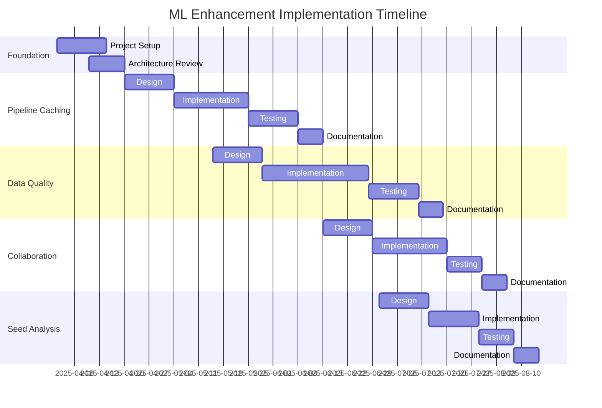

# ML Implementation Roadmap

**IMPLEMENTATION STATUS: IMPLEMENTED**

## Overview

This document outlines the implementation plan for the recommended enhancements to the WITHIN ML platform. It provides timelines, priorities, and resource requirements for each enhancement, serving as a guide for development teams.

## Recommended Enhancements

The following enhancements have been prioritized based on their potential impact on model quality, system efficiency, and team productivity:

1. [Automated Reuse of Pipeline Outputs](#automated-reuse-of-pipeline-outputs)
2. [Enhanced Data Quality Controls](#enhanced-data-quality-controls)
3. [Enhanced Cross-Functional Collaboration](#enhanced-cross-functional-collaboration)
4. [Seed Sensitivity Analysis](#seed-sensitivity-analysis)

## Implementation Timeline

## Enhancement Details

### Automated Reuse of Pipeline Outputs

#### Implementation Plan

| Phase | Timeframe | Description | Deliverables |
|-------|-----------|-------------|--------------|
| Design | April 20 - May 4, 2025 | Design caching strategy and infrastructure | Design document, architecture diagram |
| Implementation | May 4 - May 25, 2025 | Implement `CachingPipelineExecutor` class and integration points | Working implementation, unit tests |
| Testing | May 25 - June 8, 2025 | Performance testing, integration testing | Test reports, performance metrics |
| Documentation | June 8 - June 15, 2025 | Update documentation | Updated pipeline docs, usage examples |

#### Resource Requirements

- 1 Senior ML Engineer (70% time)
- 1 ML Engineer (100% time)
- Infrastructure support for cache storage and management

#### Integration Points

- `app/models/ml/pipelines/base.py` - Add caching functionality to base pipeline class
- `app/models/ml/pipelines/feature_pipeline.py` - Integrate caching for feature generation
- `app/models/ml/pipelines/training_pipeline.py` - Integrate caching for model training steps

#### Success Metrics

- 40% reduction in computation time for unchanged pipeline steps
- 99.9% cache hit consistency (same inputs produce same cached outputs)
- No degradation in model quality metrics

### Enhanced Data Quality Controls

#### Implementation Plan

| Phase | Timeframe | Description | Deliverables |
|-------|-----------|-------------|--------------|
| Design | May 15 - May 29, 2025 | Design enhanced validation framework | Design document, anomaly detection algorithms |
| Implementation | May 29 - June 28, 2025 | Implement `EnhancedDataValidator` class and detection algorithms | Working implementation, unit tests |
| Testing | June 28 - July 12, 2025 | Test with synthetic and real data | Test reports, detection metrics |
| Documentation | July 12 - July 19, 2025 | Update documentation | Updated validation docs, usage guidelines |

#### Resource Requirements

- 1 Senior Data Scientist (50% time)
- 1 ML Engineer (100% time)
- Access to anonymized production data for testing

#### Integration Points

- `app/models/ml/data/validation.py` - Replace existing validator with enhanced version
- `app/models/ml/data/preprocessing.py` - Integrate validation in preprocessing pipeline
- `app/api/endpoints/upload.py` - Add validation to data upload endpoints

#### Success Metrics

- 85% detection rate for mislabelled data (measured on synthetic test dataset)
- Less than 5% false positive rate for anomaly detection
- Reduction in model retraining cycles due to bad data

### Enhanced Cross-Functional Collaboration

#### Implementation Plan

| Phase | Timeframe | Description | Deliverables |
|-------|-----------|-------------|--------------|
| Design | June 15 - June 29, 2025 | Design collaboration framework and integrations | Design document, integration specs |
| Implementation | June 29 - July 20, 2025 | Implement `CollaborationManager` and notification system | Working implementation, integration with MLflow |
| Testing | July 20 - July 30, 2025 | Test with simulated workflows | Test reports, user feedback |
| Documentation | July 30 - August 6, 2025 | Update documentation | Collaboration guides, API documentation |

#### Resource Requirements

- 1 ML Engineer (70% time)
- 1 Backend Engineer (50% time)
- 1 UX Designer (30% time) for notification design

#### Integration Points

- `app/models/ml/experiment/tracking.py` - Integrate with experiment tracking
- `app/models/ml/deployment/manager.py` - Add notifications for deployments
- `app/api/services/notification.py` - Create notification service

#### Success Metrics

- 30% reduction in time from experiment completion to stakeholder review
- 100% critical event notification delivery
- Positive team feedback on collaboration workflow

### Seed Sensitivity Analysis

#### Implementation Plan

| Phase | Timeframe | Description | Deliverables |
|-------|-----------|-------------|--------------|
| Design | July 1 - July 15, 2025 | Design sensitivity analysis framework | Design document, analysis methodology |
| Implementation | July 15 - July 29, 2025 | Implement `analyze_seed_sensitivity` function and reporting | Working implementation, visualization tools |
| Testing | July 29 - August 8, 2025 | Test with multiple model types | Test reports, sensitivity profiles |
| Documentation | August 8 - August 15, 2025 | Update documentation | Analysis guides, interpretation guidelines |

#### Resource Requirements

- 1 Senior ML Engineer (40% time)
- 1 Data Scientist (60% time)

#### Integration Points

- `app/models/ml/evaluation/sensitivity.py` - Implement sensitivity analysis
- `app/models/ml/training/trainer.py` - Add hooks for seed management
- `app/dashboard/analytics/sensitivity.py` - Add visualization components

#### Success Metrics

- 100% coverage of model types in sensitivity analysis
- Identification of high-sensitivity components
- Establishment of seed variability baselines for all models

## Implementation Strategy

### Development Approach

The implementation will follow these principles:

1. **Incremental Development**: Each enhancement will be developed in small, testable increments
2. **Continuous Integration**: All code will be integrated frequently with automated testing
3. **Feature Flagging**: New capabilities will be implemented behind feature flags for controlled rollout
4. **Backward Compatibility**: Enhancements will maintain compatibility with existing systems
5. **Documentation-Driven**: Documentation will be updated simultaneously with code changes

### Testing Strategy

Each enhancement will undergo:

1. **Unit Testing**: Testing individual components in isolation
2. **Integration Testing**: Testing interaction with existing systems
3. **Performance Testing**: Measuring impact on system performance
4. **User Acceptance Testing**: Validation with key stakeholders

### Rollout Plan

Enhancements will be rolled out in phases:

1. **Alpha**: Internal testing with development team
2. **Beta**: Limited deployment with selected users
3. **General Availability**: Rollout to all users with monitoring
4. **Optimization**: Post-deployment optimization based on usage patterns

## Dependencies and Risks

### Dependencies

- MLflow integration for collaboration features
- Storage infrastructure for pipeline caching
- Access to sensitive data for validation testing

### Risks and Mitigations

| Risk | Impact | Likelihood | Mitigation |
|------|--------|------------|------------|
| Cache invalidation complexity | High | Medium | Implement comprehensive cache invalidation tests, conservative cache policy |
| False positives in data validation | Medium | Medium | Tunable confidence thresholds, human review for edge cases |
| Notification overload | Medium | High | Configurable notification preferences, prioritization system |
| Performance impact of additional analysis | Medium | Medium | Opt-in analysis, asynchronous processing |

## Resource Allocation

### Team Composition

- 2 Senior ML Engineers
- 2 ML Engineers
- 1 Data Scientist
- 1 Backend Engineer (part-time)
- 1 UX Designer (part-time)
- 1 QA Engineer

### Budget Allocation

| Enhancement | Development (person-weeks) | Infrastructure | Total Estimate |
|-------------|-------------|---------------|---------------|
| Pipeline Caching | 10 | $5,000 | $35,000 |
| Data Quality Controls | 12 | $2,000 | $38,000 |
| Cross-Functional Collaboration | 8 | $3,000 | $29,000 |
| Seed Sensitivity Analysis | 6 | $1,000 | $19,000 |
| **Total** | **36** | **$11,000** | **$121,000** |

## Conclusion

This implementation roadmap provides a structured approach to enhancing the WITHIN ML platform with capabilities that will improve efficiency, quality, and collaboration. By following this roadmap, the development team can prioritize efforts, allocate resources effectively, and deliver high-impact improvements on a predictable schedule.

The roadmap will be reviewed monthly and adjusted based on changing requirements, technical discoveries, and user feedback. 