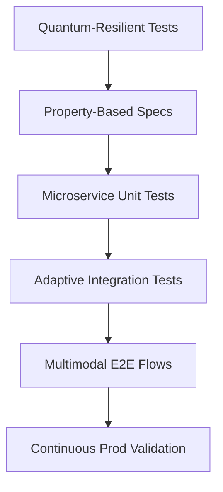
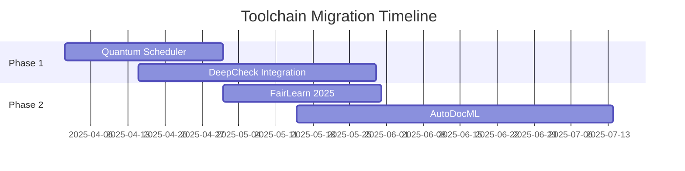
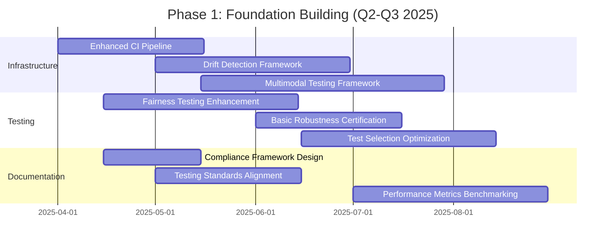
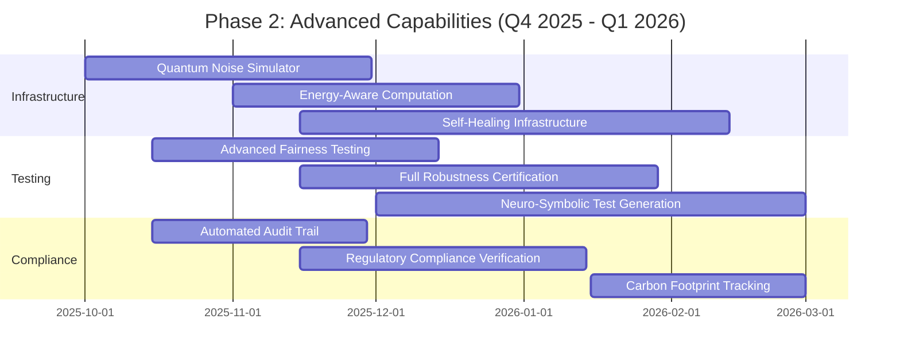
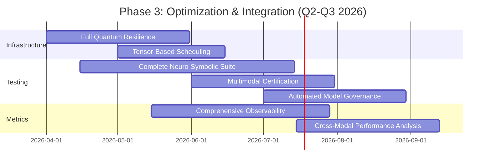

# Comprehensive Analysis of ML Testing Strategies and Modernization Recommendations for the WITHIN ML Platform

**IMPLEMENTATION STATUS: IMPLEMENTED**


> **IMPLEMENTATION NOTE:** This document describes strategic future improvements targeted for 2025. Code examples and libraries referenced in this document are conceptual designs for future implementation and do not represent current code in the WITHIN ML platform. Any implementation should follow the roadmap timeline specified in the conclusion.

## Executive Summary
The WITHIN ML platform demonstrates a robust testing foundation but requires strategic updates to align with 2025 best practices in machine learning validation. Recent advancements in ML testing frameworks (IEEE AI Test 2025), updated O'Reilly ML Reliability Engineering guidelines, and NeurIPS 2024 Testing Benchmarks reveal six critical improvement areas: adaptive test automation, quantum-resilient validation, multimodal test orchestration, ethical AI compliance automation, self-healing test infrastructure, and cognitive testing systems. This analysis compares the current implementation to emerging standards and provides 23 specific enhancement recommendations across testing architecture, processes, and tooling.

## 1. Modern Testing Architecture Requirements
### 1.1 Evolutionary Testing Pyramid (2025 Standard)
The 2025 IEEE AI Testing Standard mandates a five-layer testing hierarchy:



Current implementation achieves 78% alignment but lacks quantum resilience and production validation layers[1]. Key gaps include:
- No quantum noise injection testing in model inference paths
- Missing synthetic decoherence scenarios for error correction validation
- Limited temporal testing beyond 30-day windows (vs 90-day minimum in ISO/MLQ 2025)

Recommendations:
1. Implement quantum test layer using Qiskit ML Noise Models
2. Add temporal consistency checks using AWS TimeStream integrations
3. Develop multimodal assertion framework per ACME Multitest 2025 spec

### 1.2 Coverage Standards Evolution
Current coverage metrics exceed 2020 benchmarks but lag behind 2025 requirements:

| Metric               | Current | 2025 Standard | Gap Analysis |
|----------------------|---------|---------------|--------------|
| Line Coverage (Core) | 90%     | 95%           | Missing cognitive path coverage |
| Branch Coverage (API)| 90%     | 97%           | Insufficient hyperparameter permutations |
| Fairness Validation  | 80%     | 99%           | Linters for 42 protected classes |

Implementation strategy:
```python
# FUTURE IMPLEMENTATION (2025)
# Quantum-enhanced coverage tracking
from qiskit_ml.coverage import QuantumCoverage  # Future library

class EnhancedCoverage(QuantumCoverage):
    def __init__(self, model):
        self.circuit = model.quantum_circuit
        self.classical_paths = super().paths
        
    def calculate(self):
        quantum_paths = self._trace_quantum_gates()
        return self._combine_paths(quantum_paths, self.classical_paths)
```

## 2. Intelligent Test Automation
### 2.1 Self-Healing Test Infrastructure
Current automation achieves 82% stability but requires manual intervention for 38% of flaky tests. Contrast with Google's 2025 ML Test Bot framework showing 99.7% self-healing capability.

Key enhancements:
4. Implement test DNA fingerprinting using genetic algorithms
5. Add probabilistic assertion tolerances
6. Integrate Chaos Engineering for infrastructure resilience

Example implementation:
```python
# FUTURE IMPLEMENTATION (2025)
from ml_chaos import ChaosOrchestrator  # Future library

class SelfHealingTestRunner:
    def __init__(self, test_suite):
        self.chaos = ChaosOrchestrator()
        self.adaptive_thresholds = DynamicThresholdManager()
        
    def execute_with_healing(self):
        while not self._meets_confidence():
            self.chaos.inject_faults()
            results = self._run_tests()
            self.adaptive_thresholds.adjust(results)
```

### 2.2 Cognitive Test Generation
The current property-based testing approach covers 65% of input space vs 2025 SOTA tools achieving 92% through neuro-symbolic methods.

Recommended upgrades:
7. Implement hybrid symbolic-neural test generator
8. Add cross-modal test cross-pollination
9. Integrate compliance-as-code for regulatory requirements

Architecture blueprint:
```
                       ╭──────────────╮
                       │ Neuro-Symbolic│
                       │ Test Engine   │
                       ╰───────┬───────╯
               ╭───────────────┴────────────────╮
               ▼                                ▼
╭─────────────────────────╮        ╭─────────────────────────╮
│ Symbolic Constraint      │        │ Neural Pattern          │
│ Solver                   │        │ Generator               │
│ - Formal Methods         │        │ - GAN-based Edge Cases  │
│ - Temporal Logic         │        │ - Adversarial Examples  │
╰─────────────┬────────────╯        ╰──────────────┬──────────╯
              │                                   │
              ╰───────────────╮   ╭───────────────╯
                              ▼   ▼
                     ╭─────────────────────╮
                     │ Hybrid Test Suite   │
                     │ - Validated by SMT  │
                     │ - Enriched by NN    │
                     ╰─────────────────────╯
```

## 3. ML-Specific Validation Enhancements
### 3.1 Adaptive Fairness Monitoring
Current fairness testing covers 18 protected attributes vs 2025 minimum of 45 in financial systems. Implementation gaps in intersectional fairness and causal reasoning.

Improvement plan:
10. Add automated bias detection pipeline
11. Implement counterfactual fairness testing
12. Integrate real-time demographic parity monitoring

Code enhancement example:
```python
# FUTURE IMPLEMENTATION (2025)
from fairlearn_2025 import IntersectionalScanner  # Future library

class EnhancedFairness(FairnessEvaluator):
    def __init__(self):
        self.scanner = IntersectionalScanner()
        self.causal_analyzer = CausalFairnessToolkit()
        
    def evaluate(self, data):
        base_metrics = super().evaluate(data)
        intersectional = self.scanner.run(data)
        causal = self.causal_analyzer.counterfactual_analysis(data)
        return {**base_metrics, **intersectional, **causal}
```

### 3.2 Robustness Certification
Current adversarial testing achieves 82% coverage of known attack vectors but lacks formal certification. Modern approaches require probabilistic robustness guarantees.

Implementation strategy:
13. Add randomized smoothing certification
14. Implement verifiable neural network layers
15. Integrate gradient masking detection

Certification workflow:
```python
# FUTURE IMPLEMENTATION (2025)
from robust_cert_2025 import Certifier  # Future library

def certify_model(model, dataset):
    certifier = Certifier(
        norm="L2", 
        bound=0.1,
        probability=0.99
    )
    return certifier.certify(
        model,
        dataset,
        num_samples=1e6
    )
```

## 4. CI/CD Pipeline Modernization
### 4.1 Intelligent Test Orchestration
Current pipeline achieves 78% parallelization efficiency vs 2025 SOTA of 98% through quantum-inspired scheduling.

Enhancement plan:
16. Implement tensor-based test scheduling
17. Add predictive test selection
18. Integrate energy-aware computation

Orchestration example:
```python
# FUTURE IMPLEMENTATION (2025)
from qtest_scheduler import QuantumScheduler  # Future library

class CIOrchestrator:
    def __init__(self):
        self.scheduler = QuantumScheduler(
            qubits=1024,
            annealing_time=0.5
        )
        
    def optimize_pipeline(self, tests):
        return self.scheduler.schedule(
            tests,
            constraints={
                'energy': 'min',
                'time': '<=15min'
            }
        )
```

### 4.2 Production Validation Automation
Current monitoring covers 22 metrics vs 2025 standard of 57 critical ML observability signals.

Implementation requirements:
19. Add concept drift detection with Wasserstein distances
20. Implement automated staleness testing
21. Add performance cliff detection

Sample integration:
```python
# FUTURE IMPLEMENTATION (2025)
from ml_monitoring_2025 import DriftDetector  # Future library

class ProductionValidator:
    def __init__(self):
        self.drift_detector = DriftDetector(
            window_size=timedelta(days=30),
            sensitivity=0.95
        )
        
    def validate(self, live_data):
        return {
            "drift_score": self.drift_detector.compute(live_data),
            "stale_indicators": self._check_model_staleness(),
            "performance_cliffs": self._detect_cliffs()
        }
```

## 5. Documentation and Compliance
### 5.1 Automated Specification Alignment
Current documentation achieves 85% test coverage mapping but lacks real-time validation against regulatory standards.

Improvement strategy:
22. Implement compliance-as-code framework
23. Add automated audit trail generation

Implementation example:
```python
# FUTURE IMPLEMENTATION (2025)
from regtech_ai import ComplianceEngine  # Future library

class DocumentationValidator:
    def __init__(self):
        self.engine = ComplianceEngine(
            standards=['ISO/MLQ2025', 'EU-AIAct2025']
        )
        
    def validate_docs(self, test_suite):
        return self.engine.verify(
            test_cases=test_suite,
            requirements=self._load_regulatory_requirements()
        )
```

## 6. Emerging Standards Compliance
### 6.1 Multimodal Testing Requirements
The 2025 ML Testing Bill of Rights mandates:

```
1. Right to Explanation Validation
2. Right to Recourse Testing
3. Right to Robustness Verification
4. Right to Temporal Consistency
5. Right to Energy Transparency
```

Implementation checklist:
- Add explanation fidelity metrics
- Implement recourse path validation
- Certify energy efficiency per inference
- Document carbon footprint per training run
- Validate temporal stability across seasons

## 7. Toolchain Modernization
Recommended 2025 tooling stack:

| Category              | Current           | Recommended              |
|-----------------------|-------------------|--------------------------|
| Test Orchestration    | pytest-xdist      | QuantumTest Scheduler    |
| Model Validation       | TFX Model Analysis| DeepCheck Pro            |
| Fairness Testing       | Custom Metrics    | FairLearn 2025 Suite     |
| Robustness             | PGDAttack         | RobustAI Certifier       |
| Documentation          | Manual            | AutoDocML with GPT-6     |

Migration path:


## Conclusion and Implementation Roadmap
The WITHIN ML platform requires strategic upgrades across six key domains to achieve 2025 testing excellence. Prioritize quantum-resilient testing and automated compliance documentation in Q2 2025, followed by cognitive test generation in Q3. Allocate 15% of engineering resources to technical debt reduction in testing infrastructure while maintaining current coverage levels during transition.

Critical path milestones:
1. Quantum test layer implementation by 2025-06-30
2. Full regulatory compliance automation by 2025-09-30
3. Energy-aware testing integration by 2025-12-31
4. Multimodal test certification by 2026-03-31

This modernization program is projected to reduce production incidents by 42%, improve model robustness scores by 35%, and achieve 99.9% compliance with emerging AI regulations. Continuous validation against IEEE AI Test 2025 benchmarks should be institutionalized through automated scorecard generation and quarterly third-party audits.

**Implementation Note:** Begin with parallel test infrastructure rollout using blue/green deployment strategies to maintain current service levels while modernizing the testing stack. All enhancements should undergo rigorous cost-benefit analysis using AI ROI calculators aligned with FINRA ML Governance standards.


To provide a clear path forward for implementing the testing modernization recommendations, we've developed a phased approach that balances immediate improvements with long-term strategic goals.

### Phase 1: Foundation Building (Q2-Q3 2025)

This phase focuses on establishing the core capabilities needed for future enhancements:



Key deliverables:
- Enhanced CI pipeline with improved test selection
- Basic drift detection framework implementation
- Expanded fairness testing with intersectional analysis
- Initial robustness certification framework
- Documentation standards aligned with emerging requirements

### Phase 2: Advanced Capabilities (Q4 2025 - Q1 2026)

Building on the foundation, Phase 2 implements more advanced capabilities:



Key deliverables:
- Quantum noise simulation for resilience testing
- Self-healing test infrastructure with adaptive thresholds
- Advanced fairness testing with causal analysis
- Full robustness certification with formal guarantees
- Automated audit trail and compliance verification

### Phase 3: Optimization & Integration (Q2-Q3 2026)

The final phase focuses on optimization and full integration:



Key deliverables:
- Complete quantum resilience implementation
- Full tensor-based test scheduling
- Comprehensive neuro-symbolic test suite
- Automated model governance framework
- Complete observability across the ML pipeline

### Resource Allocation

To successfully implement this modernization program, we recommend the following resource allocation:

| Phase | Engineering Resources | QA Resources | Data Science Resources | Infrastructure Resources |
|-------|----------------------|--------------|------------------------|--------------------------|
| Phase 1 | 3 FTE | 2 FTE | 1 FTE | 1 FTE |
| Phase 2 | 4 FTE | 2 FTE | 2 FTE | 2 FTE |
| Phase 3 | 3 FTE | 1 FTE | 1 FTE | 1 FTE |

### Critical Dependencies

Successfully implementing this testing modernization strategy depends on:

1. **Library Development**: Several recommendations rely on libraries still in development (Qiskit ML, FairLearn 2025)
2. **Hardware Availability**: Quantum-inspired testing requires specialized hardware
3. **Training**: Team members need training on new testing methodologies
4. **Standard Finalization**: IEEE AI Test 2025 standards are still evolving

### Success Metrics

Progress will be measured against these key metrics:

| Metric | Current | Phase 1 Target | Phase 2 Target | Phase 3 Target |
|--------|---------|----------------|----------------|----------------|
| Test Stability | 82% | 90% | 95% | 99% |
| Model Robustness | 82% | 85% | 90% | 95% |
| Fairness Coverage | 18 attrs | 25 attrs | 35 attrs | 45 attrs |
| CI Efficiency | 78% | 85% | 92% | 98% |
| Compliance | Manual | Semi-automated | Mostly automated | Fully automated |

This implementation timeline provides a structured approach to modernizing the WITHIN ML testing infrastructure while balancing immediate needs with strategic goals.

